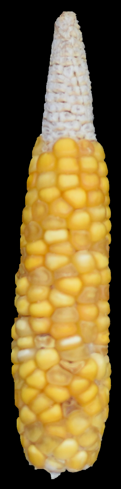
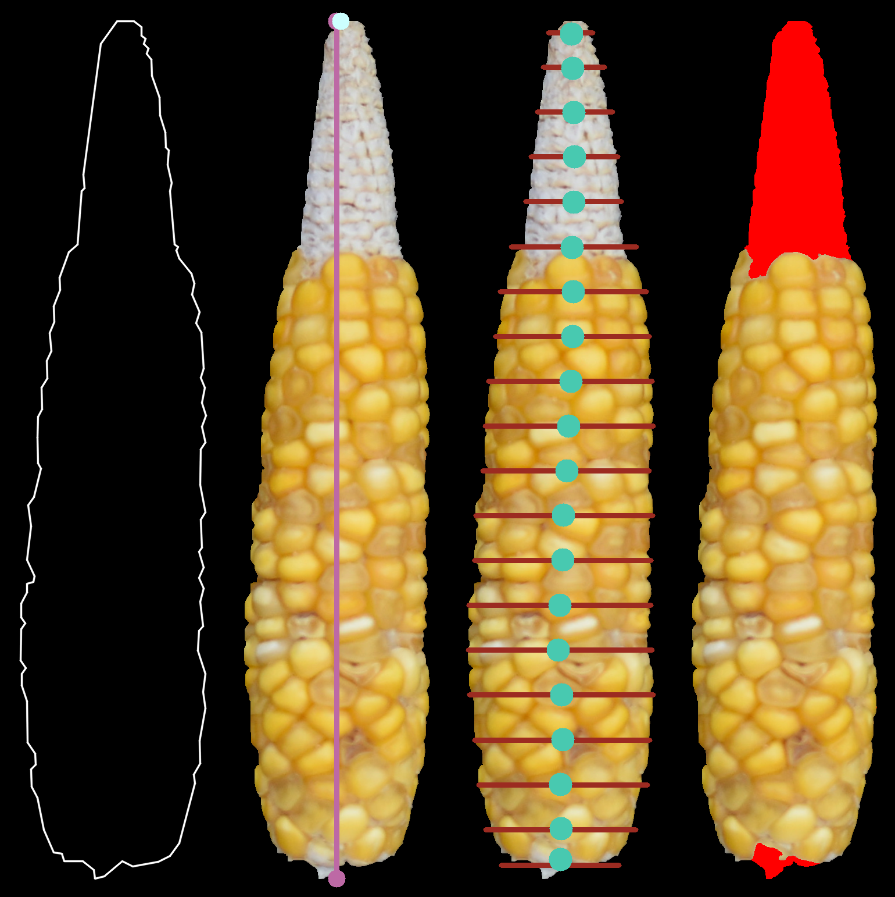

.. highlight:: rst

=====
EarCV
=====

-------------------------------------------------------
A python-based tool for automated maize ear phenotyping
-------------------------------------------------------

This tool allows the user to rapidly extract features from images containing maize ears against a uniform background. It was designed with the intention of facilitating analysis of thousands of images with a single command prompt. As output, this tool creates a .csv with features for each ear found in the input image(s) and prints several proofs to monitor tool performance.

-----------
Quick Start
-----------

We will asume you are running this from the main ''EarCV/'' folder contianing this repo. Let's use images within the ''/test/'' folder as examples. 

^^^^^^^^^^^^^^
Simplest case:
^^^^^^^^^^^^^^
Image only containing a single ear::

	python ./src/main.py -i ./test/IN/test_img_1.JPG -o ./test/OUT/

Output:

.. image:: ./test/OUT/01_Proofs/test_img_1_proof.png
	:height: 100px
	:width: 200 px
	:scale: 50 %
	:alt: alternate text
	:align: right

Now lets run the same image with default cob and shank segmentation::

	python ./src/main.py -i ./test/IN/test_img_1.JPG -o ./test/OUT/ -t 0 0 0 0 -b 0 0 0 0 

Output:

^^^^^^^^^^^^^^^^^^
Full feature case:
^^^^^^^^^^^^^^^^^^

Let's run an image with all of the features using default settings::

	python ./src/main.py -i ./test/IN/test_img_2.png -o ./test/OUT/ -qr -clr ./test/IN/clrchr.png -ppm 10 -t 0 0 0 0 -b 0 0 0 0

Output:

.. image:: ./test/OUT/01_Proofs/test_img_2_proof.png
    :alt: alternate text

-----
Usage
-----

^^^^^^^^^^^^^^^^^^^^^^^^^^^
Installation & Dependencies
^^^^^^^^^^^^^^^^^^^^^^^^^^^

Just download this repo and make sure you have all the dependencies installed on your python environment of choice. This tool uses the folowing packages:

* OpenCV 2
* numpy
* scipy
* pyzbar (optional, QR code module)
* plantcv (optional, Color correction module)

^^^^^^^^^^^^^
Main pipeline
^^^^^^^^^^^^^
This tool uses any standard image format (.jpg, .jpeg, .png, or .tiff). To start, the main function does the following:

* Segments ears photographed against a uniform background
	- Background can be any color insofar it contrasts well with the ears.
	- Algorithm can take any number of ears, in any configuration or arrangment.
	- Ears may touch slightly in the image.
	- Ears may have silk and other debri.

* For each ear:
	- Extracts basic morphological features
	- Segments cob and shank from kernels
	- Extracts kernel features
	- (in development) Estimates Kernel Row Number
	- (in development) Predicts USDA quality Grade
 
^^^^^
Input
^^^^^

	Required:

	-i, --image      	   Path to input image file, required. Accepted formats: 'tiff', 'jpeg', 'bmp', 'png'.

	Optional:

	-o, --OUTDIR     	   Provide path to directory to save proofs, logfile, and output CSVs. Default: Will save in current directory if not provided.

	-ns, --no_save   	   Default saves proofs and output CSVs. Raise flag to stop saving.

	-np, --no_proof		   Default prints proofs on screen. Raise flag to stop printing proofs.

	-D, --debug     	   Raise flag to print intermediate images throughout analysis. Useful for troubleshooting.

For complete usage documentation run::

	python ./src/main.py -h

^^^^^
Output
^^^^^
The output structure is as follows::

	./OUT/
	|--- 01_Proofs/
	|--- 02_Ear_ROIs/
	|--- 03_Ear_Proofs/
	|--- EarCV.log
	|--- qrcode.csv
	|--- color_check.csv
	|--- features.csv

* Proofs
	Use proofs to monitor performance. ''01_Proofs'' documents qr code extraction, color correction, pixels per metric calculation, and ear segmentation. ''02_Ear_ROIs'' contains the region of interest for each segmented ear. ''03_Ear_Proofs'' conatins a proof for each individual ear showing various feature extraction results. 
* EarCV.log
	Every time you run the script, the terminal prints a log of what is happening under the hood.
* qrcode.csv
	File with the image name and the corresponding information found in QR code.
* color_check.csv
	File with color correction preformance metrics based on root mean squared differences in color.
* features.csv
	File with the ear features as columns and ears as rows.

^^^^^^^^^^^^^^^^
Optional modules
^^^^^^^^^^^^^^^^
* QR code extraction
	- Helps you keep track of who is what in what image in your experiment.
	- Scans image for QR code and returns found information.
* Color correction
	- Standizes colors across any number of images to make robust color comparisons.
	- Performs color correction on images using a color checker.
* Pixels per metric conversion
	- Want your morphemetric measurements in inches? centimeters?
	- Converts pixel measurements into any unit of length or area.
	- Calculates the pixels per metric using a solid color square in the input image of known dimensions.

^^^^^^^^^^^^^^^^^^^^
Output: Ear features
^^^^^^^^^^^^^^^^^^^^

Anytime you use this tool you will get the following features:

	* Filename:					Name of image file or QR code if qr code module turned on
	* Ear Number:				If image conatins multiple ears, each ear gets an ear number.
	* Ear_Area:					The area of the entire ear. 
	* Ear_Box_Area:				Area of the smallest bounding box containing the ear.
	* Ear_Box_Length:			Length of the smallest bounding box containing the ear.
	* Ear_Box_Width: 			Width of the smallest bounding box containing the ear.
	* Max_Width: 				Width is measured 20 evenly-spaced slices along the length of the ear. Gives the widest part of the ear.
	* perimeters: 				Perimeter of the ear contour
	* Convexity: 				Ratio of ear perimeter over convex hull perimeter.
	* Solidity: 				Ratio of ear area over the convex hull area.
	* Convexity_polyDP: 		Ratio of smoothed ear perimeter over convex hull perimeter.
	* Taper: 					Standard deviations of the 10 slices along the top half of the ear.
	* Taper_Convexity: 			Ratio of perimeter over convex hull perimeter of the top half of the ear.
	* Taper_Solidity: 			Ratio of area over the convex hull area of the top half of the ear.
	* Taper_Convexity_polyDP: 	Ratio of smoother perimeter over convex hull perimeter of the top half of the ear.
	* Widths_Sdev: 				Standard deviation of the width of 20 evenly-spaced slices along the length of the ear.
	* Cents_Sdev: 				Standard deviation of the midpoint of 20 evenly-spaced slices along the length of the ear.
	* Tip_Area: 				If cob segementation is turned on: Area of the cob tip. Excludes kernels
	* Bottom_Area: 				If cob segementation is turned on: Area of the bottom of the ear. Excludes kernels.
	* Krnl_Area: 				If cob segementation is turned on: Area of the kernel portion of the ear.
	* Kernel_Length: 			If cob segementation is turned on: Length of the smallest bounding box containing the kenrnels.
	* Krnl_Convexity: 			If cob segementation is turned on: Ratio of ear perimeter over convex hull perimeter containing the kenrnels.
	* Tip_Fill: 				If cob segementation is turned on: Ratio of tip cob area over total ear area.
	* Bottom_Fill: 				If cob segementation is turned on: Ratio of bottom cob area over total ear area.
	* Krnl_Fill: 				If cob segementation is turned on: Ratio of kernel area over total ear area.
	* Blue: 					Pixel intensity value of entire ear. If cob segementation is turned on: Pixel intensity value of kernel.
	* Red: 						Pixel intensity value of entire ear. If cob segementation is turned on: Pixel intensity value of kernel.
	* Green: 					Pixel intensity value of entire ear. If cob segementation is turned on: Pixel intensity value of kernel.
	* Hue: 						Pixel intensity value of entire ear. If cob segementation is turned on: Pixel intensity value of kernel.
	* Sat: 						Pixel intensity value of entire ear. If cob segementation is turned on: Pixel intensity value of kernel.
	* Vol: 						Pixel intensity value of entire ear. If cob segementation is turned on: Pixel intensity value of kernel.
	* Light: 					Pixel intensity value of entire ear. If cob segementation is turned on: Pixel intensity value of kernel.
	* A_chnnl: 					Pixel intensity value of entire ear. If cob segementation is turned on: Pixel intensity value of kernel.
	* B_chnnl: 					Pixel intensity value of entire ear. If cob segementation is turned on: Pixel intensity value of kernel.

^^^^^^^^^^^^^^^^^^
QR code extraction
^^^^^^^^^^^^^^^^^^

.. literalinclude:: ./src/qr.py
    :linenos:
    :language: python
    :lines: 1, 3-5
    :start-after: 3
    :end-before: 5

